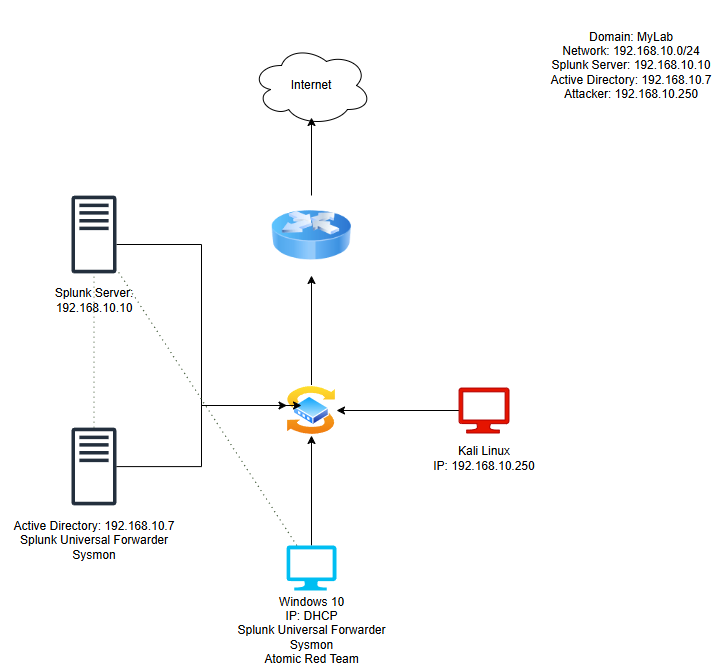
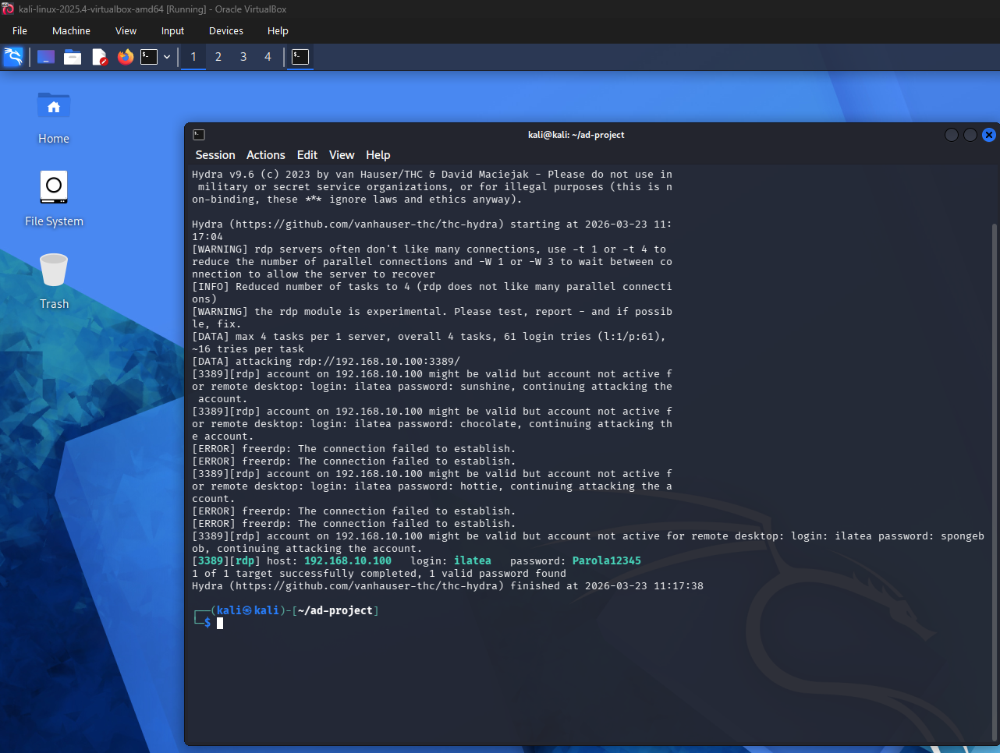
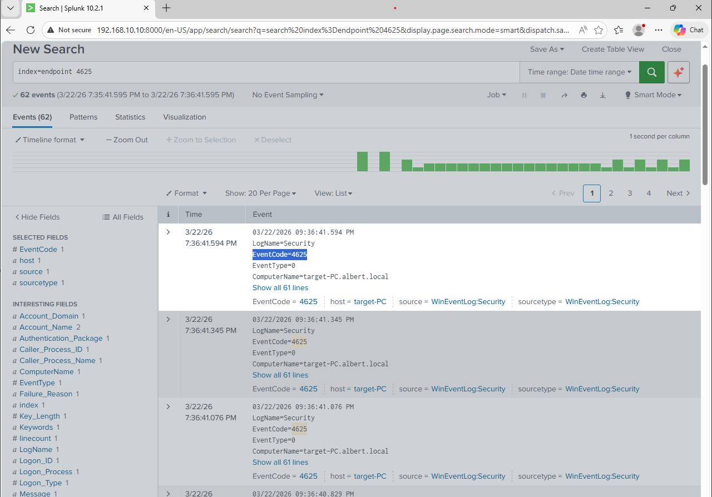

# 🛡️ Active Directory Home Lab

> A fully virtualized Active Directory environment built for hands-on cybersecurity practice, simulating real-world attacks and detecting them with Splunk.

---

## Project Overview

This project involves building a home lab from scratch using VirtualBox to simulate a small corporate network. The goal was to understand how Active Directory environments work, how attackers target them, and how to detect malicious activity using a SIEM solution (Splunk).

---

## Lab Environment

| Machine | OS | IP Address | Role |
|---|---|---|---|
| **Splunk Server** | Ubuntu (Server) | 192.168.10.10 | SIEM / Log Aggregation |
| **ADWS** | Windows Server 2022 | 192.168.10.7 | Active Directory Domain Controller |
| **Target** | Windows 10 | 192.168.10.100 (DHCP) | Victim Machine |
| **Attacker** | Kali Linux 2025.4 | 192.168.10.250 | Attack Machine |

- **Domain:** MyLab  
- **Network:** 192.168.10.0/24 (NAT Network - `AD-Project`)  
- **Hypervisor:** Oracle VirtualBox

---

## Network Diagram



The diagram shows the full lab topology including the switch connecting all VMs, the router providing internet access, and the individual machine roles.

---

## Tools & Technologies

| Tool | Purpose |
|---|---|
| VirtualBox | Virtualization / Hypervisor |
| Windows Server 2022 | Active Directory Domain Controller |
| Windows 10 | Target / victim machine |
| Kali Linux 2025.4 | Attack machine |
| Splunk (Ubuntu) | SIEM - log collection & analysis |
| Splunk Universal Forwarder | Log forwarding from Windows machines |
| Sysmon | Enhanced Windows event logging |
| Hydra | Brute force attack tool |
| Atomic Red Team | Threat simulation framework |

---

## Lab Setup Summary

### Active Directory
- Installed and configured Windows Server 2022 as a Domain Controller
- Created domain: `MyLab`
- Added Windows 10 machine to the domain
- Created user accounts for attack simulation

### Monitoring Stack
- Deployed **Splunk** on Ubuntu server (`192.168.10.10`)
- Installed **Splunk Universal Forwarder** on both Windows machines to forward logs to Splunk
- Installed **Sysmon** on both Windows machines for enriched event logging (process creation, network connections, etc.)
- Installed **Atomic Red Team** on the Windows 10 machine for future threat simulation

---

## Attacks Simulated

### 1. RDP Brute Force Attack - Hydra

| Field | Detail |
|---|---|
| **Target** | Windows 10 - `192.168.10.100` |
| **Tool** | Hydra |
| **Protocol** | RDP (Port 3389) |
| **Outcome** | ✅ Valid credentials found |
| **Detected by Splunk** | ✅ Yes |

#### Attack Command
```bash
hydra -l ilatea -P passwords.txt rdp://192.168.10.100
```

#### What Happened
1. Launched Hydra from Kali Linux targeting the Windows 10 machine over RDP
2. Hydra cycled through a password list against the username `ilatea`
3. Valid credentials were successfully found
4. Splunk detected the attack via a flood of **Event ID 4625** (failed logon) entries followed by **Event ID 4624** (successful logon)

#### Splunk Detection
- **Event ID 4625** - Multiple failed logon attempts in a short time window (brute force indicator)
- **Event ID 4624** - Successful logon after the burst of failures (compromise indicator)




#### Mitigation
- Enable **Account Lockout Policy** (lock account after N failed attempts)
- Disable **RDP** if not required, or restrict access via firewall rules
- Enforce **Multi-Factor Authentication (MFA)** on RDP
- Monitor for **Event ID 4625** spikes using Splunk alerts

---

## Splunk Queries Used

```spl
# Detect brute force - multiple failed logons
index=endpoint EventCode=4625
| stats count by src_ip, user
| where count > 10

# Detect successful logon after failures (potential compromise)
index=endpoint EventCode=4624
| stats count by src_ip, user, LogonType
```

---

## Challenges & Lessons Learned

- **Crowbar vs Hydra:** Initially attempted to use Crowbar for the RDP brute force but encountered compatibility issues. Switched to Hydra which successfully performed the attack, a good real-world lesson in having backup tools.
- **Sysmon configuration:** Tuning Sysmon to generate useful logs without flooding Splunk required iterating on the config file.
- **Network isolation:** Keeping the lab on a NAT Network ensures attack traffic stays isolated from the real network.

---

## References

- [Splunk Documentation](https://docs.splunk.com)
- [Sysmon - Microsoft Sysinternals](https://learn.microsoft.com/en-us/sysinternals/downloads/sysmon)
- [Atomic Red Team](https://atomicredteam.io)
